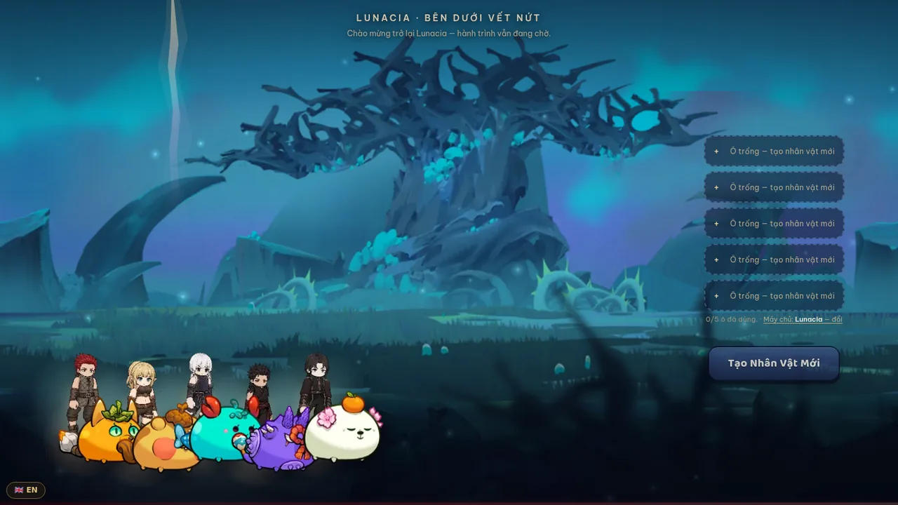
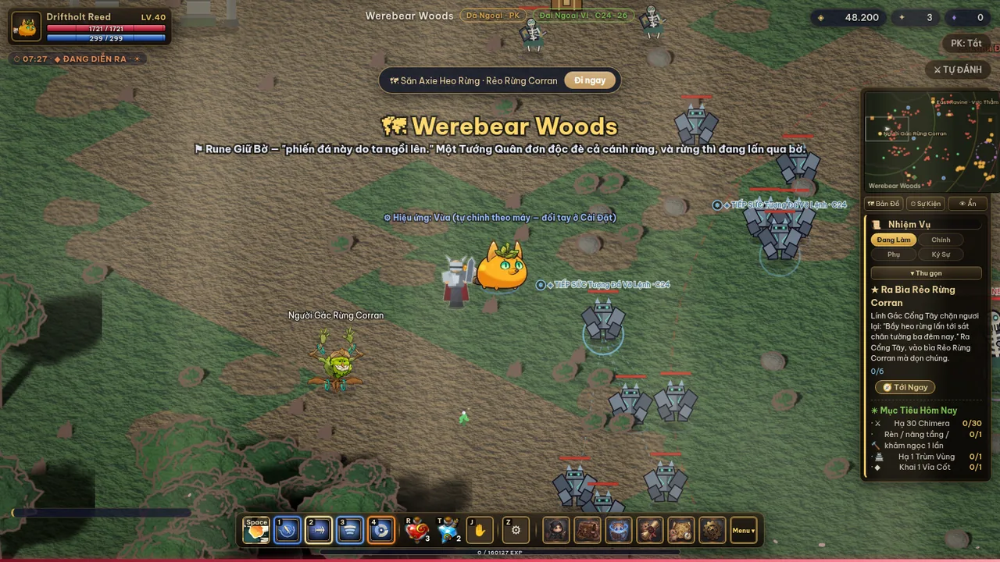

# Axie Rift

A browser action-RPG set in Lunacia, built in the shape of classic MU Online. Original IP on Axie
Infinity lore, made for the Axie Infinity Builder's Program.

**Your Axie is your body. The five classes are your power.** You play as an Axie; when you strike,
a Dark Knight — or a Dark Wizard, a Sylvan Ranger, a Spellblade, a Dark Lord — materialises beside
you, casts, and dissolves. Every stat, every skill and every piece of gear lives on the class. The
Axie carries none of it, so any Axie can be any class.



## Play it

**▶ Live build: http://14.225.204.107/?test=1&lang=en** — nothing to install, nothing to sign up for.

The game is Vietnamese-first; `&lang=en` puts it in English before the first frame, so you never
have to find a settings toggle to read it. Drop the parameter (or use `&lang=vi`) for Vietnamese.
Either way the choice is remembered.

No wallet, no platform account, no token, nothing onchain — not as a fallback, but because none
of it is in the build. Progress is saved to `localStorage` in your own browser.

That `?test=1` starts you wearing a full set of real art gear instead of bare-skinned, so the
character and equipment art is visible from the first second. It grants no levels and no currency —
the game underneath is the normal one.

If you would rather see the end of the game than play up to it, `?max=1` gives you level 120 with
every system unlocked and maxed: end-game gear at +11, wings, jewels, Box Kundun.

**▶ With other people: http://14.225.204.107/?net=1** — open it in two browsers and you are in the
same world. Details in [Playing together](#playing-together) below.

Or run it locally. `public/game/` is a self-contained static app — canvas 2D + vanilla JS, no build
step, no backend, no `.env`, no database:

```bash
git clone https://github.com/ShanKyos/axierift.git
cd axierift/public/game
python3 -m http.server 8850     # or: npx serve -l 8850
```

Open `http://localhost:8850/`. Auth and cloud-save calls to `/api/*` will fail behind a plain static
server; the game degrades to local-only play, which is enough to see everything below.



*Level 40 in Werebear Woods. The orange Axie is the player; the armoured figure beside it is the
Dark Knight layer, summoned for the swing. It fades after the hit — the Axie never leaves.*

## What you actually do

Pick one of five classes, and an Axie to be. Then it is an MU-shaped action-RPG: right-click to
walk, Space to swing, `1`–`4` for the four skills you dragged onto the bar yourself.

The loop, in the order you meet it:

1. **Clear a camp.** Monsters stand in camps, and a camp's *role* — tank, ranged, caster, healer —
   is set by the camp, not the species. So three species produce six different fights, and the two
   roles auto-play handles worst (casters and healers) are the reason you take the mouse back.
2. **Pick the loot up off the ground.** Nothing teleports into your bag. Drops land, bounce, and
   sit there for 45 seconds with a name tag coloured by rarity.
3. **Put it on, then beat on it.** Eleven slots, per-class armour lines, sockets, and forging from
   +0 to +11 — where +7 is the threshold that starts to glow, and the glow reads by *hue*, not
   brightness, so +9 and +11 are different objects rather than the same object brighter.
4. **Go somewhere on purpose.** Warded Chests sit at fixed spots with a four-role guard camp and
   open once per character, ever — so the map becomes a place you remember. Bone Seams move to
   three new coordinates every real day, which is the one thing in the world that auto-play cannot
   put on a schedule.
5. **Be somewhere at a time.** Three world events run off the real clock — a world boss every four
   hours, a golden invasion on the odd offset, a rift lord four times a day. Nothing is stored;
   arrive late and you missed it.

Chapters of the main quest each close on that region's General, and each opens exactly one system —
and every one of those gates has a real quest guarding it rather than a tooltip mentioning it.

## Controls

Desktop keyboard and mouse. In game, `F6` shows this same table, and Settings has a language
toggle — or put `?lang=en` on the URL to start in English.

| | |
|---|---|
| Right-click | Walk there — works on the minimap too |
| `Space` | Basic attack |
| `1` `2` `3` `4` | The four skill slots (you assign them by dragging from the skill tree) |
| `R` / `T` | Red Potion / Mana Flask |
| `Z` | Toggle auto-fight |
| `J` | Pick up loot · open a Warded Chest · mine a Bone Seam · gather herbs |
| `E` | Talk to whoever is nearby |
| `C` `V` `B` `K` `M` `Q` | Character · Gear · Bag · Skills · Map · Quest log |
| `N` · `O` · `F6` · `Esc` | Jewel bank · Settings · Help · Close |

**First five minutes.** You start inside **Sapidae Chiefdom** — the walled hub, which is the
Ardhaven quarter that came through the rift. Take the **West Gate** to Rẻo Rừng Corran (*Corran
Woodstrip*), levels 1–12, and kill something. Press `Q` for what the quest chain wants next.

Mind which gate: the four hub gates lead to level 1, 10, 20 and **60** regions respectively, and
nothing stops you walking out of the wrong one. West is the one meant for a new character.

## Playing together

`?net=1` connects you to a live relay server running beside the game. There is no account, no
login, nothing to install — open the link in two browsers and the second one is another player.

You see each other move and run, with names and health bars; you see each other **fight** — the
class layer materialises beside the other player's Axie on every swing and every cast, then
dissolves; and you can talk in two channels, **World** and **Region**, the second reaching only
people standing in the same map.

*Two browsers means two different sessions. Chrome shares one incognito session across all its
incognito windows, so "two incognito windows" is still one character — use one normal window plus
one incognito, or two different browsers.*

**What it deliberately does not do yet.** The server is a 445-line relay with **zero dependencies**
— `node server/bongnguoi.js`, no `npm install`, no database. It forwards positions and chat lines
and nothing else. No accounts, no authority, no anti-cheat, no PvP, no shared monsters, no shared
loot. That is the design, not an oversight: anything with lasting value — spawning an item,
crediting currency, a shared boss health bar — has to wait for real accounts and a server-side
inventory, or you are building an economy on a server that believes whatever the client says. The
reasoning is written out in [`docs/THIET_KE_ONLINE.md`](docs/THIET_KE_ONLINE.md).

**Offline is the default and stays first-class.** With no server in the URL, `net.js` returns on its
first line and the single-player build runs byte-identically. All 208 regressions run on that path,
and one of them asserts the reverse direction: no server in the URL must mean no connection.

The two guards worth reading are [`tests/test_wsnho.js`](tests/test_wsnho.js), which drives the
hand-written WebSocket framing from a raw TCP socket — a browser is too polite a client to exercise
masking rules, split frames, or the 2-byte length branch — and
[`tests/test_bongnguoi.js`](tests/test_bongnguoi.js), which launches the real server, opens two real
Chromium pages, and counts pixels rather than checking that a function exists.

## What's in it

All numbers below are read out of the running game, not counted by hand.

| | |
|---|---|
| Classes | 5 — Dark Knight · Sylvan Ranger · Dark Wizard · Spellblade · Dark Lord |
| Axie bodies | 16, each with its own baked animation sheets; granted through the Khế Ước gacha |
| Levels | 1–120, paced to ~3 hours to level 60 — measured in-engine, not guessed (`tools/do_nhipcap.cjs` → `tools/can_exp.cjs`) |
| Maps | 13 — a walled hub town, 9 wilderness regions, 2 corridors, 1 dungeon. Regions run 4200×3200 to 5200×3800, the hub 6400×3200; all tile-laid isometric ground, no painted backdrops |
| Mobs | 48 types, with roles assigned **per camp** rather than per species, so three species still produce six fight profiles |
| Quests | 50-quest main chain across 9 chapters + 32 side quests across 10 maps |
| Gear | 11 slots, per-class armour lines, +0…+11 forging, socketing, Chaos Machine, 3 wing tiers |
| Story | Seven Ancient Runes, one per region — the Nhát Gọi canon ([`docs/LORE_RUNE.md`](docs/LORE_RUNE.md)) |
| Multiplayer | shared world at `?net=1` — see other players move, fight and chat, on a dependency-free relay |
| Tests | 218 Playwright regressions against real Chromium + 7 vitest units, all gated in CI |

## Why it is an Axie game and not a reskin

The lore does load-bearing work rather than sitting in flavour text. Runes are the Bug axies' craft —
carving a law into stone that holds in one place. Seven of them hold Lunacia together, and they are
wearing thin. So Sylas carves a Rune into the *sky* to call for a smith who can make something more
durable than stone, and what comes through the cut is a whole quarter of Vaeldra: paving, forge, and
seven soldiers.

That single premise pays for three things the genre normally leaves unexplained:

- **why a Dark Knight is standing in Lunacia** — Lunacia called you; you are not a conqueror
- **why the hub is a western stone town with a forge** — the forge *is* what Lunacia asked for
- **why you lost your memory but not your craft** — the Rune is paid in what it moves, and craft
  cuts deeper than memory, so it comes back as you level

And the central bargain is a real cost, not a twist: pulling a Rune to the forge makes it last
another thousand years, but while it sits in the fire, the law it held is simply *off*.

**It is mechanical, not just narrative.** Your Axie's class decides what you are strong and weak
against, using Axie Infinity's own nine-class triangle — never how strong you are. The full design,
with the measurements behind it and an honest account of what is shipped versus planned, is in
**[`docs/AXIE_CORE.md`](docs/AXIE_CORE.md)**.

## Where this goes next

The design has one line it does not cross: **an Axie never grants a stat.** Every expansion below
is a matchup, a profile, or a choice — because the moment an Axie grants +damage, this becomes a
game where the best Axie wins. Three earlier versions of this codebase were dismantled for exactly
that, and the removals are logged.

**Near term — matchup literacy.** Three of the four channels exist. Walking into a region prints
the verdict for the Axie you are wearing (*"Aquatic takes 10% LESS here"*, or *"takes 12% MORE —
Beast / Bug / Mech would take less"*); every hit you take floats the matchup over your head; and
the Map panel names each region's class and the three that counter it.

That third channel was the last thing added, and finding it was the point: the defensive side had
been running for the whole project while printing **almost nothing**. It had one output — a line
in the 260px combat log in the bottom-left corner — and that line only fired on the *unfavourable*
branch. The favourable half, the half that answers "why own more than one Axie", had never once
appeared on screen. The attack direction, by contrast, had a floating label with four prefixes.
A mechanic nobody can read is a mechanic that does not exist.

The channel still missing is the Axie picker: preview how each body performs where you are headed,
so the choice is made before the trip rather than learned during it.

Building that third channel turned up a real bug that had been shipping: the floating label was
throttled against a timestamp initialised to zero, and `performance.now()` counts from page load
— so the **first 2.6 seconds of every session showed nothing**, which to a player reading a new
mechanic is indistinguishable from the mechanic not existing. A test that opens a fresh page and
attacks immediately now guards it.

**Shipped since — parts, not just class.** An Axie is six body parts, each with its own class,
and the game now reads all six. Count how many share the Axie's own triangle group and you get
its purity: a pure Axie is a specialist (much safer where it is favoured, much more exposed
where it is not), a mixed one is a generalist. Two Beast Axies can now play differently.

It is laterally, not upward, and that is provable rather than asserted. The three multipliers
are interpolated toward their own mean, so across a uniform spread of all nine mob classes every
one of the 16 Axies has the **same** expected defensive multiplier — measured spread `2.2e-16`,
which is floating-point noise. Changing your Axie changes the shape of your risk and cannot
change the total. Against real regional populations the shape is large: the purest Axies swing
39% between their kindest and harshest region, the most mixed one swings 10%.

**Long term — the Rune economy.** Weapons carry class Runes today as a rolled property. The canon
supports making Runes something you *carve*: transfer one between weapons, or inscribe one you
recovered from a region's Ancient Rune. That turns the story's central object into the item
economy's central verb.

**And the multiplayer has a stated stopping point, not an open promise.** Phase 1 is shared
presence — see each other move, fight and chat. Everything past it (shared monsters, party loot, a
shared boss health bar) needs real accounts and a server-side inventory first, because a relay that
believes the client cannot be allowed to mint anything. The seven-phase route is in
[`docs/KHAO_SAT_ONLINE.md`](docs/KHAO_SAT_ONLINE.md); the fork in the road is in
[`docs/THIET_KE_ONLINE.md`](docs/THIET_KE_ONLINE.md).

## Browsers, devices, and known issues

**Tested:** desktop **Chromium**, mouse and keyboard — 208 Playwright regressions drive the actual
game in a real Chromium on every change, so that is the browser with evidence behind it. The engine
is canvas 2D with no WebGL and no build step, so other modern desktop browsers should work, but
Firefox and Safari have not been tested and I am not going to claim them. Settings has quality and
resolution scalers (down to 50%) for weaker machines, with an auto mode.

**Not supported:** touch. There is no mobile control scheme; WASD was removed in favour of
click-to-move and the UI assumes a pointer and a keyboard. It will render on a phone and it will
not play well.

**Known issues, measured rather than guessed:**

| | |
|---|---|
| **The interface is Vietnamese first.** English is a toggle in Settings, backed by a 572-entry dictionary plus 137 pattern rules. Coverage is good but not complete — only 35 strings go through the real `t()` layer, and the rest rely on that dictionary | the honest read: an English-speaking judge can play it, and will still meet Vietnamese text |
| **The live link is a raw IP over plain HTTP.** No TLS, no domain | browsers will flag it as not secure; there is nothing to enter, so nothing is at risk, but it looks worse than it is |
| **Walk and run cycles slide.** Measured: the planted foot only carries ~49% of the visual stride, so 51% of the distance is slide baked into the drawings | no code value fixes it; the cycles have to be redrawn. Spec and acceptance thresholds: [`docs/DAT_HANG_TUONG_DI.md`](docs/DAT_HANG_TUONG_DI.md) |
| **Armour art covers 3 of 35** class × tier combinations; the rest fall back to the bare body | adding one is a data row, not code — the debt is art, not engineering |
| **Spellblade is missing a sprite row** — 96 cells where the other four classes have 112 | its run block only reads the first half of the cycle |
| **Level pacing above 60 cannot currently be re-measured.** `tools/do_nhipcap.cjs` returns zero XP/hour at levels 60+ | pre-existing, not caused by recent work — verified by re-running the tool against an earlier commit, which produces the identical zeros. So the "33 hours to 120" figure in the docs is not a live measurement today, and we say so where it appears |
| **`cheatExec` still ships**, and the multiplayer relay has no authority | harmless offline; it has to go before anything shared has value |
| **Two regression tests are dice-rolls**, not deterministic | both documented in [`CLAUDE.md`](CLAUDE.md) with the measurements that separate "red because of my change" from "red because of the dice" |

## Submission notes

**AI tools used — materially, for nearly all of it.** The code was written with **Claude Code**
(Opus), working from [`CLAUDE.md`](CLAUDE.md) as a living spec; that file is also the post-mortem
log, so the mistakes are on the record next to the numbers that exposed them. Character, weapon and
armour art was generated with **Meowa** as Spine packages and baked to sprite sheets by the scripts
in `tools/spine/`. Isometric ground tiles and world props were rendered with **Blender** (via the
`bpy` PyPI module) from `tools/iso/`.

**Pre-existing work and provenance.** The engine was migrated from an earlier wuxia action-RPG by
the same author — same codebase lineage, different game; the migration is finished and logged. No
starter template or fork. Axie character rigs, VFX clips and UI jewel icons come from the official
[`axieinfinity/axie-origins-asset-kit`](https://github.com/axieinfinity/axie-origins-asset-kit).
Fonts are Baloo 2 under the SIL Open Font Licence, vendored with its licence file in
`public/game/fonts/`. Audio is vendored under its own terms. The game itself ships **no runtime
dependencies** — canvas 2D and vanilla JS; `npm` is only for the optional shell and the test
harness.

**Rights and safety.** No wallet, no account, no token, no onchain mechanic anywhere in the build.
No personal data is collected — progress lives in your browser's `localStorage`. The one network
feature, chat, escapes every line through `createElement` + `textContent` rather than `innerHTML`,
with rate limiting enforced server-side rather than in the client;
[`tests/test_chat.js`](tests/test_chat.js) asserts that by querying the DOM for injected elements,
not by string-matching. Licensing is deliberately source-available rather than MIT, and
[`LICENSE`](LICENSE) explains why.

**Not included:** a demonstration video. The live build and this repository are the submission.

## Where to look, per judging criterion

Not a self-assessment — just the shortest path to the evidence for each one.

| Criterion | Where it lives | What to check |
|---|---|---|
| **Axie Core** | [`docs/AXIE_CORE.md`](docs/AXIE_CORE.md) · [`tests/test_tamgiac.js`](tests/test_tamgiac.js) · [`tests/test_bophan.js`](tests/test_bophan.js) | Two axes, neither of them a stat. The nine-class triangle decides matchups; the six body parts decide how sharp that matchup is. Opens with the measurement that showed the first version had failed — all 16 Axies changed exactly zero stats — and shows what each later stage moved, including a before/after taken by removing a stage and re-measuring. The body-part test carries the strongest claim in the project: expected defensive multiplier is **identical across all 16 Axies** to within floating-point noise, so the mechanic provably reshapes risk without selling any |
| **Gameplay** | [What you actually do](#what-you-actually-do) · the live build | Roles are set per camp, not per species. Loot lands on the ground. Chests open once per character. Seams move daily. Events run on the real clock |
| **Product vision** | [Where this goes next](#where-this-goes-next) · [`docs/AXIE_CORE.md`](docs/AXIE_CORE.md) §7 | Three layers that deepen Axie identity without selling power, and a multiplayer roadmap with a stated stopping point |
| **Feasibility** | this repo | It is already built and already running. No build step, no runtime dependencies, no database; the multiplayer server is two files and needs only `node` |
| **Prototype & docs** | [`CLAUDE.md`](CLAUDE.md) · `tools/reg.sh` · [`docs/BANG_MAP.md`](docs/BANG_MAP.md) | 208 browser regressions plus CI on every push. Design decisions are recorded with the measurement that produced them, and the known-issues table above is the same standard applied to what is still wrong |

## How it's built

One file, no framework, no build step: `public/game/game.js` is the entire engine — `update()`,
`render()`, `calcDerived()`, and `hurtMob()` as the single damage-application point in the game.
Data lives in `public/game/data/canbang.js`. Edit, reload, done.

The part worth reviewing is the discipline around it:

- **CI gates every push to `main`** — typecheck, lint, unit tests, and a syntax check of the engine
  ([`.github/workflows/ci.yml`](.github/workflows/ci.yml)).
- **218 Playwright regressions** drive the real game in a real browser — they call `startGame()`,
  `castSkill()`, `turnInQuest()` and tick `update()`, rather than asserting against fixtures.
  `bash tools/reg.sh <outdir>`.
- **Design decisions are measured, then written down with the measurement.** Level pacing was fitted
  to XP-per-hour sampled from actual play. Map quality has a machine-generated status table
  ([`docs/BANG_MAP.md`](docs/BANG_MAP.md)) and a ratchet test that only lets it improve.
- **[`CLAUDE.md`](CLAUDE.md)** is the working spec and the post-mortem log: every trap already
  stepped in, with the number that exposed it. It is long because the mistakes were expensive.

## Repo map

| Path | |
|---|---|
| `public/game/` | the game — engine, data, assets. Self-contained, no build |
| `tests/` | 218 Playwright regressions |
| `server/` | the multiplayer relay — two files, no dependencies, `node server/bongnguoi.js` |
| `tools/` | asset bakers (Spine → sprite sheets, isometric tiles), measurement scripts, `reg.sh` |
| `docs/` | decision journal. **Historical by design** — entries are not rewritten when things change, so read dates and cross-check against code. Current canon is `CLAUDE.md` + `docs/LORE_RUNE.md` |
| `src/`, `api/`, `db/` | the Vite + Hono + tRPC + MySQL shell around the game (auth, cloud save). Not needed to play |

Full dev workflow, if you want the shell too:

```bash
npm install
cp .env.example .env
npm run dev      # single Vite process, /api/* proxied in-process to Hono
npm run check    # tsc -b
npm test         # vitest
bash tools/reg.sh /tmp/reg-x    # full Playwright regression, ~30 min
```

## Two things to know before reading the code

**Identifiers are Vietnamese, and some are older than the game.** This is a Vietnamese-language game,
so functions and data keys are Vietnamese (`hurtMob` sits next to `veAvatar`, `banRaiVung`,
`viaHomNay`). Separately, the engine was migrated from a shipped wuxia RPG, and a few names from
before that migration were kept on purpose: class and NPC keys (`thieulam`, `baidasan`, `quachtinh`)
because save files are keyed on them, and the server path `/var/www/axiewuxia` because the deploy
cron runs out of it. None of them ever reaches player-visible text. The migration itself is
finished — the wuxia setting, vocabulary and systems are gone.

**The licence is deliberately not open source.** See [`LICENSE`](LICENSE) — it is source-available,
all rights reserved, and the file explains why: some Builder's Program source material carries
"do not distribute" terms, and vendored third-party assets (fonts, audio, Spine packages) arrive
under their own licences. A blanket MIT grant would misstate rights that are not the author's to
grant. For permission to use any part of this, contact the repository owner.
