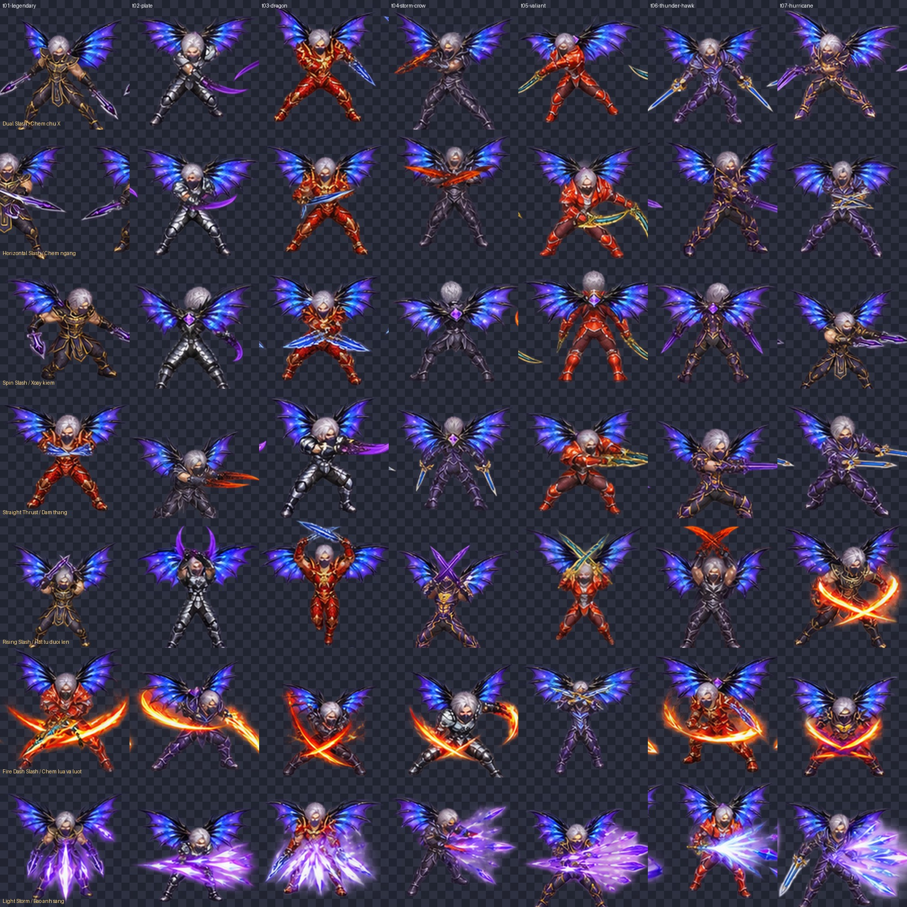

# Magic — 7 Armor × 7 Attack × 8 Direction + Wing v1

Bộ sprite Magic dành cho tích hợp và kiểm tra animation trong game.

## Tải gói Core

- [magic-7armor-7attack-8dir-wing-v1-core.zip (295 MB)](https://chatgpt.com/api/library/files/libfile_c42dbc7578f481918223adcfc013637a/download)
- SHA-256: `29f5b8c8bebb8482b686a725c96b1eaa5292febb7e8c7a40c5a05e46e95598ec`

> ZIP lớn hơn giới hạn file Git thông thường, vì vậy repo chỉ lưu README, manifest và preview. Gói ZIP được giữ dưới dạng file tải riêng.

## Nội dung

- 7 bộ giáp và cặp vũ khí mặc định.
- Magic Wing Tier 2 ghép tại khớp vai.
- 7 nhóm Attack, mỗi nhóm 8 hướng × 8 frame.
- Sheet chuẩn hóa 2048×2048; mỗi frame 256×256.
- Nhân vật hạ thân/chạm chân xuống đất khi ra đòn dù đang đeo wing.

## Thứ tự hướng

`south, south-west, west, north-west, north, north-east, east, south-east`

## Nhóm Attack

1. `dual-slash` — chém chữ X hai nhịp.
2. `horizontal-slash` — chém ngang.
3. `spin-slash` — xoay kiếm 360°.
4. `straight-thrust` — đâm thẳng.
5. `rising-slash` — hất kiếm từ dưới lên.
6. `fire-dash-slash` — lướt ngắn kết hợp chém lửa.
7. `light-storm` — dồn lực và tung Bão Ánh Sáng.

## Runtime

- Grid: 8 cột × 8 hàng.
- Frame: 256×256.
- Pivot đề xuất: `(0.5, 0.94)`.
- Render order: `wing_back -> body_armor_weapon -> skill_vfx`.
- FPS cụ thể nằm trong `manifest.json`; có thể điều chỉnh 10–15% theo tốc độ đánh.

## Production note

Đây là sprite raster để kiểm tra chuyển động và tích hợp. Trước khi phát hành chính thức nên duyệt từng frame va chạm tay/kiếm, làm sạch viền alpha, và tách VFX của `fire-dash-slash`/`light-storm` thành layer riêng nếu cần recolor hoặc tối ưu draw call.
